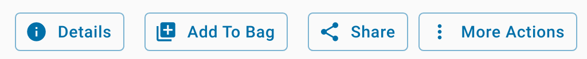

.. include:: cyverse_rst_defined_substitutions.txt
.. include:: custom_urls.txt

|CyVerse_logo|_

|Home_Icon|_
`Learning Center Home <http://learning.cyverse.org/>`_

Your Workbench
--------------

**Description:**

CyVerse have integrated several Docker containers into the Discovery Environment data science workbench |VICE| platform, 
and made them "Public" for anyone with a CyVerse account to use.

NEON example data sets are rehosted on the CyVerse Data Store, along with complete ``.ipynb`` and ``.Rmd`` notebooks and ``.r`` scripts

In this section, we're going to walk through the required steps of selecting an app, importing data, starting an interactive analysis, and shutting it down.

|Discovery Environment Guide|

..
	#### Comment: short text description goes here ####

----

*Starting a VICE app*
~~~~~~~~~~~~~~~~~~~~~

**1.** Log into the Discovery Environment `https://de.cyverse.org <https://de.cyverse.org>`_

   If you click this Quick Launch button you will be taken directly to the RStudio Geospatial featured app:

   - RStudio Geospatial Latest: |rstudio-geospatial-latest|_

**2.** Click the |apps_button| 'Apps' icon in the table of contents in the left frame. 

   Featured Apps use verified images with the |shield| shield icon,

   |apps_search1|

   Alternatevely, query "rstudio geospatial" in the search bar and see what comes up,
  
   |apps_search2|

**3.** After you select an app, you need to fill out four parameter fields. 

  **i.**   ``Analysis Info`` - you can change the name of the analysis if you like, the default name is typically ``<the-app-name>_analysis1``

   Your analysis will run, and when it completes, it will write any data that you have in the WORKING DIRECTORY of the container back to the Data Store in your Analyses folder, e.g. ``/iplant/home/<username>/analyses/<the-app-name>_analysis1-<DATE-TIME-of-job-starting>``

  **ii.** The second section is ``Parameters`` and has options for adding (1) a single file, or (2) a folder with many files. 

   For our use case today, we're going to add a shared folder from the community released data space.

  |add_data_window2|

   Add the path: ``/iplant/home/shared/NEON_workshop/`` 

  |add_data_window1|

    .. admonition:: Input Data (not required)

     When you launch a new VICE app, you can add data to it before it is launched. If you do this, it will slow down the launch, as the service must copy the data from the data store into your new instance before it becomes available. 
     
     A faster option is to start the container without the data, and then copy the data into the running container later using WebDav, iCommands, or a file system mount.

   **iii.** The third section is ``Advanced Settings (optional)``, again you can leave the default settings, or you can modify them.

   You can set the ``Minimum CPU`` to the minimum number of cores your app requires. If you do not select anything, the app will still be able to use multiple cores on the shared node on which it is deployed.

   You can set the ``Minimum Memory`` to the minimum number of GB of RAM you think your app requires. 

   You can set the ``Minimum Disk Space`` to the minimum amount of scratch space you think your data will need.

   **iv.** The last section is ``Review and Launch``, click "Launch Analysis" to start the app.

    The screen should change to a VICE Loading screen

    |vice_loading|

**4.** Click the |analyses_button| icon labeled "Analyses" to view your running and stopped apps.

    click the square icon with an arrow pointed up to the right |goto| and a new browser tab will open.

    |analyses_window|

    Alternately, click the bell icon in the upper right to see your notifications, you should see 'Access your running analysis here.' as an option. Click on that link and a new browser tab will open.

**5.** Open new browser tab with the analysis.

   The Discovery Environment tab should still be open at ``https://de.cyverse.org/de/`` 

   A new URL for the analyses should be something like ``https://af7664685.cyverse.run/``.

   When your app is ready your browser tab should appear as an RStudio-Server. 

**6.** Analyses options.

   In the table of contents, click on Analyses |analyses_window| and select the check box for your running analysis. A set of options will appear on the right side.

   |checkbox_options|

   You have multiple options available here:

   |analyses_options|

   ``Go to output folder`` will take you to the output folder in yout ``/analyses`` Data store path. This output folder will not exist until AFTER you end the running analysis.

   ``Relaunch`` -- (re)launch with the same parameters

   ``Rename`` -- rename analysis

   ``Update Comments`` -- update comments about the analysis 

   ``Go to analyses`` -- opens the analysis in a new browser tab

   ``Extend Time Limit`` -- all apps have a set time-out which can be extended, use this feature to keep an app running for more time.

   ``Terminate`` -- shut down and complete the analysis, files will be copied back to your user's `/analyses` folder

   ``Delete`` -- this option is only available after you have stopped your App and want to remove the information from your Analysis window
   
   ``Add to Bag`` -- adds analyses, files, and folders for sharing with others in your 'bag'.

*Stopping a VICE app*
~~~~~~~~~~~~~~~~~~~~~

**1.** After you've finished working on your instance, it is conscientious to shut down your analysis and free up share resources for other researchers. 

**2.** Make sure that your data that you've copied into the running Analysis have been moved to another storage location on the internet, or back into your data store in another file path.

**3.** Analysis data that are in the single working directory "WORKDIR" of the container that the App has set in its configuration file will be saved back to the Data Store in your ``/iplant/home/<username>/analyses/<the-app-name>_analysis1-<DATE-TIME-of-job-starting>`` folder.

**4.** When the job ends, any data that are in other ``/temp`` or ``/home/username`` folders in the running App WILL NOT BE SAVED or written back to the Data Store.

**5.** Click on the icon with the three vertical dots or select the app with the check box and click on the ``More Actions`` buton.

   ``Terminate`` **DANGER Zone** -- when you click this, your job will be stopped and your analysis results will be copied to the ``/analyses`` folder

   ``Delete`` **DANGER Zone** -- when you click this, your job will be stopped and your results will not be written back to the data store.

**6.** Depending on how much data you have in the WORKDIR folder of the running App, the analysis may take a few minutes to complete and shut down.

**7.** When the Analysis completes, you will now have the option to Delete the finished job. 

----

**Description of output and results**

**IMPORTANT:** These data are currently running in a virtual machine, which will soon be going away, either when it times out, or you turn it off. You need to make sure that your data are moved to a data repository, like the CyVerse Data Store, or downloaded to your localhost, before you turn this analysis off.

Any data which are in the working directory of ``/iplant/home/<username>/analyses/<the-app-name>_analysis1-<DATE-TIME-of-job-starting>`` directory). Any data which are in other paths will not be preserved

----

**Fix or improve this documentation**

- Search for an answer:
  |CyVerse Learning Center|
- Ask us for help:
  click |Intercom| on the lower right-hand side of the page
- Report an issue or submit a change:
  |Github Repo Link|
- Send feedback: `learning@CyVerse.org <learning@CyVerse.org>`_

----

|Home_Icon|_
`Learning Center Home <http://learning.cyverse.org/>`_

.. Comment: Place Images Below This Line
   use :width: to give a desired width for your image
   use :height: to give a desired height for your image
   replace the image name/location and URL if hyperlinked

 .. |Clickable hyperlinked image| image:: ./img/IMAGENAME.png
    :width: 500
    :height: 100
 .. _CyVerse logo: http://learning.cyverse.org/

 .. |Static image| image:: ./img/IMAGENAME.png
    :width: 25
    :height: 25

.. Comment: Place URLS Below This Line

   # Use this example to ensure that links open in new tabs, avoiding
   # forcing users to leave the document, and making it easy to update links
   # In a single place in this document

   .. |Substitution| raw:: html # Place this anywhere in the text you want a hyperlink

      <a href="REPLACE_THIS_WITH_URL" target="blank">Replace_with_text</a>

    

.. |dots| image:: ./img/de/dots.png
    :width: 25
    :height: 25

.. |vice_loading| image:: ./img/de/vice-loading.png
    :width: 700

.. |analyses_window| image:: ./img/de/analyses_window.png
    :width: 700

.. |rstudio-geospatial-latest| image:: https://img.shields.io/badge/Geospatial-latest-blue?style=plastic&logo=rstudio
.. _rstudio-geospatial-latest: https://de.cyverse.org/apps/de/07e2b2e6-becd-11e9-b524-008cfa5ae621/launch

.. |Github Repo Link|  raw:: html

   <a href="https://github.com/CyVerse-learning-materials/2020-neon-aop-workshop" target="blank">Github Repo Link</a>

